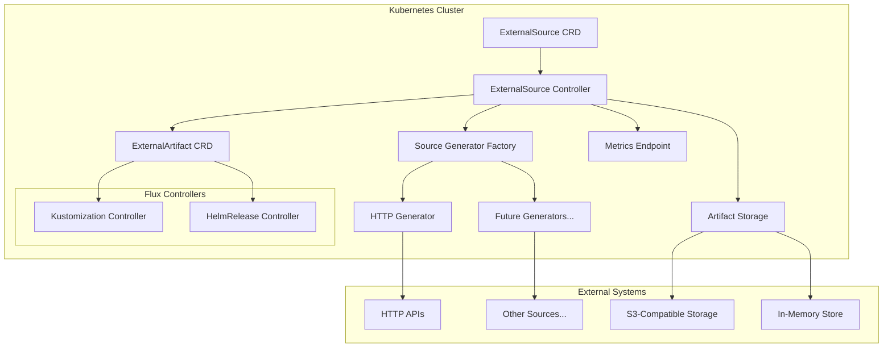

# Design Document

## Overview

The ExternalSource Controller is a Kubernetes operator built using the Kubebuilder framework that enables integration of external HTTP-based data sources into Flux GitOps workflows. The controller implements an asynchronous reconciliation pattern to fetch, transform, and package external data as versioned artifacts consumable by other Flux controllers.

The design follows cloud-native principles with emphasis on reliability, observability, and scalability. The controller manages the complete lifecycle of external data integration, from initial fetch through artifact packaging and cleanup.

A key architectural principle is modularity through pluggable source generators. The HTTP generator is the initial implementation, but the architecture supports easy addition of new source types (e.g., S3, database, message queues) without modifying core controller logic.

## Architecture

### High-Level Architecture



### Controller Architecture

The controller follows the standard Kubebuilder operator pattern with these key components:

1. **Reconciler**: Implements the core reconciliation logic
2. **Source Generator Factory**: Creates appropriate source generators based on type
3. **Source Generators**: Pluggable implementations for different source types (HTTP, future types)
4. **Hook Executor**: Executes whitelisted commands in sidecar for data processing
5. **Whitelist Manager**: Validates commands against security whitelist
6. **Artifact Manager**: Packages and stores versioned artifacts
7. **Storage Backend**: Pluggable interface for different storage implementations
8. **Metrics Collector**: Exposes Prometheus metrics for observability

## Extensibility Design

### Adding New Source Types

The modular architecture enables easy extension for new source types:

1. **Implement SourceGenerator Interface**: Create a new generator implementing the core interface
2. **Register with Factory**: Register the new generator type with the factory during controller initialization
3. **Update CRD**: Add the new generator type to the enum in the CRD schema
4. **Add Configuration**: Define type-specific configuration within the generator spec

**Example Future Source Types:**
- **S3 Generator**: Fetch objects from S3-compatible storage
- **Database Generator**: Query databases for configuration data
- **Message Queue Generator**: Consume messages from queues/topics
- **Git Generator**: Fetch specific files from Git repositories (complementing Flux's GitRepository)

### Generator Registration Pattern

```go
func (r *ExternalSourceReconciler) SetupWithManager(mgr ctrl.Manager) error {
    // Register built-in generators
    r.factory.RegisterGenerator("http", func() SourceGenerator {
        return NewHTTPGenerator(r.httpClient)
    })
    
    // Future generators can be registered here or via plugins
    // r.factory.RegisterGenerator("s3", func() SourceGenerator {
    //     return NewS3Generator(r.s3Client)
    // })
    
    return ctrl.NewControllerManagedBy(mgr).
        For(&sourcev1alpha1.ExternalSource{}).
        Complete(r)
}
```

## Components and Interfaces

### ExternalSource Custom Resource

The primary API surface for users, defining the desired state of external data integration.

**Key Fields:**
- `spec.interval`: Reconciliation frequency (minimum 1m)
- `spec.generator.http`: HTTP endpoint configuration
- `spec.hooks`: Optional pre-request and post-request hooks
- `spec.maxRetries`: Maximum retry attempts across all hooks
- `spec.destinationPath`: Target path within artifact
- `status.artifact`: Current artifact metadata
- `status.conditions`: Resource health status

### Reconciler Component

**Interface:**
```go
type ExternalSourceReconciler interface {
    Reconcile(ctx context.Context, req ctrl.Request) (ctrl.Result, error)
    SetupWithManager(mgr ctrl.Manager) error
}
```

**Responsibilities:**
- Manage reconciliation lifecycle
- Use factory to create appropriate source generator based on spec
- Coordinate between source generator, hook executor, and artifact manager
- Execute pre-request and post-request hooks with retry policies
- Update resource status and conditions
- Handle error scenarios with exponential backoff

### Source Generator Interface

**Core Interface:**
```go
type SourceGenerator interface {
    Generate(ctx context.Context, config GeneratorConfig) (*SourceData, error)
    SupportsConditionalFetch() bool
    GetLastModified(ctx context.Context, config GeneratorConfig) (string, error)
}

type GeneratorConfig struct {
    Type   string
    Config map[string]interface{}
}

type SourceData struct {
    Data         []byte
    LastModified string
    Metadata     map[string]string
}
```

### Source Generator Factory

**Interface:**
```go
type SourceGeneratorFactory interface {
    CreateGenerator(generatorType string) (SourceGenerator, error)
    RegisterGenerator(generatorType string, factory func() SourceGenerator) error
    SupportedTypes() []string
}
```

### HTTP Source Generator

**Implementation of SourceGenerator:**
```go
type HTTPGenerator struct {
    client HTTPClient
}

type HTTPConfig struct {
    URL                string
    Method             string
    Headers            map[string]string
    CABundle           []byte
    InsecureSkipVerify bool
    Timeout            time.Duration
}
```

**Features:**
- ETag-based conditional requests
- TLS configuration with custom CA bundles
- Authentication via header secrets
- Request timeout and retry logic
- Metrics collection for API latency

### Hook Executor Component

**Interface:**
```go
type HookExecutor interface {
    Execute(ctx context.Context, input []byte, hook HookSpec) ([]byte, error)
}
```

**Implementation Details:**
- Communicates with hook-executor sidecar via HTTP
- Validates commands against whitelist before execution
- Supports stdin/stdout byte streaming (base64 encoded)
- Enforces timeout and retry policies per hook
- Passes environment variables to commands
- Chains multiple hooks with data piping

### Whitelist Manager Component

**Interface:**
```go
type WhitelistManager interface {
    IsAllowed(command string, args []string) bool
    Reload() error
}
```

**Implementation Details:**
- Loads whitelist from YAML file at startup
- Validates commands and arguments using regex patterns
- Supports reload without controller restart
- Thread-safe concurrent access

### Artifact Manager Component

**Interface:**
```go
type ArtifactManager interface {
    Package(ctx context.Context, data []byte, path string) (*Artifact, error)
    Store(ctx context.Context, artifact *Artifact) (string, error)
    Cleanup(ctx context.Context, source string, keepRevision string) error
}

type Artifact struct {
    Data     []byte
    Path     string
    Revision string
    Metadata map[string]string
}
```

**Responsibilities:**
- Create .tar.gz archives with proper directory structure
- Calculate SHA256 content hashes for versioning
- Coordinate with storage backend for upload
- Implement garbage collection for obsolete artifacts

### Storage Backend Interface

**Interface:**
```go
type StorageBackend interface {
    Store(ctx context.Context, key string, data []byte) (string, error)
    List(ctx context.Context, prefix string) ([]string, error)
    Delete(ctx context.Context, key string) error
    GetURL(key string) string
}
```

**Implementations:**

1. **S3Backend**: Production-ready S3-compatible storage
   - Supports AWS S3, MinIO, and other S3-compatible services
   - Configurable bucket, region, and credentials
   - Proper error handling and retry logic

2. **MemoryBackend**: Development and testing storage
   - In-process memory storage
   - Non-persistent across controller restarts
   - Suitable for development and CI environments

## Data Models

### ExternalSource CRD Schema

```yaml
apiVersion: apiextensions.k8s.io/v1
kind: CustomResourceDefinition
metadata:
  name: externalsources.source.flux.oddkin.co
spec:
  group: source.flux.oddkin.co
  versions:
  - name: v1alpha1
    schema:
      openAPIV3Schema:
        type: object
        properties:
          spec:
            type: object
            required: [interval, generator]
            properties:
              interval:
                type: string
                pattern: '^([0-9]+(\.[0-9]+)?(ms|s|m|h))+$'
              suspend:
                type: boolean
              destinationPath:
                type: string
              maxRetries:
                type: integer
                default: 3
              hooks:
                type: object
                properties:
                  preRequest:
                    type: array
                    items:
                      type: object
                  postRequest:
                    type: array
                    items:
                      type: object
              generator:
                type: object
                required: [type]
                properties:
                  type:
                    type: string
                    enum: [http]  # Future: [http, s3, git, etc.]
                  http:
                    type: object
                    required: [url]
                    properties:
                      url:
                        type: string
                        format: uri
                      method:
                        type: string
                        default: GET
                      headersSecretRef:
                        type: object
                        properties:
                          name:
                            type: string
                      caBundleSecretRef:
                        type: object
                        properties:
                          name:
                            type: string
                          key:
                            type: string
                      insecureSkipVerify:
                        type: boolean
          status:
            type: object
            properties:
              conditions:
                type: array
                items:
                  type: object
              artifact:
                type: object
                properties:
                  url:
                    type: string
                  revision:
                    type: string
                  lastUpdateTime:
                    type: string
                    format: date-time
              lastHandledETag:
                type: string
              observedGeneration:
                type: integer
```

### Status Conditions

Standard Kubernetes conditions following the Flux pattern:

- **Ready**: Overall health of the ExternalSource
- **Fetching**: Currently fetching data from external source
- **ExecutingHooks**: Currently executing pre-request or post-request hooks
- **Storing**: Currently storing artifact
- **Stalled**: Reconciliation has been stalled due to errors

### Artifact Metadata

```go
type ArtifactMetadata struct {
    URL            string            `json:"url"`
    Revision       string            `json:"revision"`
    LastUpdateTime metav1.Time       `json:"lastUpdateTime"`
    Metadata       map[string]string `json:"metadata,omitempty"`
}
```

## Error Handling

### Error Categories

1. **Transient Errors**: Network timeouts, temporary API unavailability
   - Strategy: Exponential backoff with jitter
   - Max retry attempts: 10
   - Base delay: 1 second, max delay: 5 minutes

2. **Configuration Errors**: Invalid URLs, missing secrets
   - Strategy: Update status condition, no retry until spec changes
   - User action required to resolve

3. **Hook Execution Errors**: Command failures, timeout, whitelist violations
   - Strategy: Apply per-hook retry policy (ignore, retry, fail)
   - Respect aggregate maxRetries limit across all hooks

4. **Storage Errors**: Backend unavailability, permission issues
   - Strategy: Exponential backoff for transient issues
   - Alert on persistent storage problems

### Error Recovery

- **Controller Restart**: Resume from last known state using resource status
- **Network Partitions**: Continue serving last successful artifact
- **Storage Failures**: Maintain in-memory cache for critical operations
- **API Rate Limiting**: Implement adaptive backoff based on response headers

## Testing Strategy

### Unit Testing

**Coverage Areas:**
- Reconciler logic with mocked dependencies
- HTTP client with various response scenarios
- Hook executor with command execution and retry policies
- Whitelist manager with validation logic
- Artifact manager packaging and cleanup logic
- Storage backend implementations

**Testing Framework:**
- Go standard testing package
- Testify for assertions and mocking
- Ginkgo/Gomega for BDD-style tests (optional)

**Mock Strategy:**
- Interface-based mocking for all external dependencies
- HTTP server mocking for API integration tests
- Kubernetes client mocking using controller-runtime test utilities

### Integration Testing

**Test Scenarios:**
- End-to-end reconciliation with real HTTP endpoints
- Storage backend integration with MinIO test containers
- Kubernetes API integration using envtest
- Metrics collection and exposure verification

**Test Environment:**
- Testcontainers for external dependencies (MinIO, HTTP servers)
- Envtest for Kubernetes API server simulation
- Docker compose for complex integration scenarios

### Performance Testing

**Metrics to Validate:**
- Reconciliation latency under various loads
- Memory usage with multiple ExternalSource resources
- HTTP client performance with concurrent requests
- Storage backend throughput and latency

**Load Testing:**
- Simulate 100+ ExternalSource resources
- Concurrent reconciliation stress testing
- Large artifact handling (up to 100MB)
- Network failure recovery scenarios

### End-to-End Testing

**Scenarios:**
- Complete GitOps workflow with Flux integration
- Multi-environment deployment validation
- Disaster recovery and controller restart scenarios
- Security validation with TLS and authentication

## License

This project will be published under a permissive open-source license modeled on [the "MIT License"](https://opensource.org/license/mit)