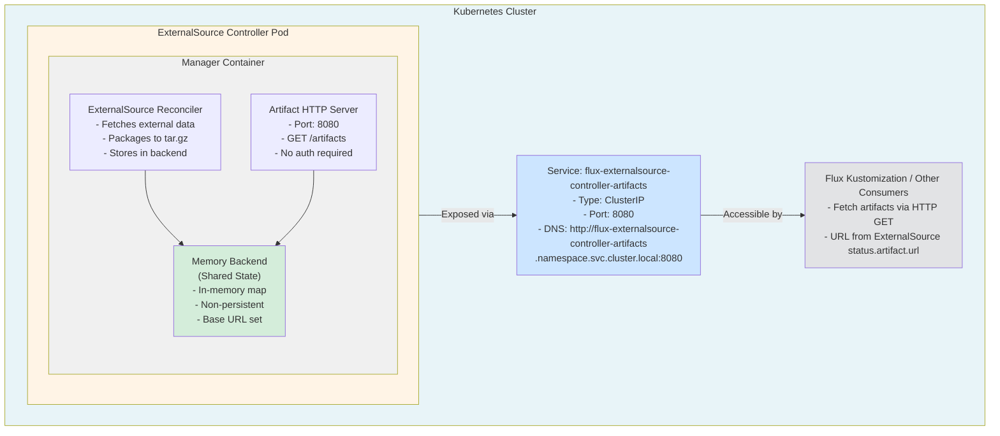

# HTTP Artifact Server

## Overview

The HTTP Artifact Server enables the ExternalSource controller to serve artifacts stored in the memory backend through an HTTP endpoint within the cluster. This allows artifacts to be accessed via cluster-internal URLs instead of the mock `memory://` scheme, making them compatible with Flux and other Kubernetes-native tools.

**Key Features:**
- Serves memory backend artifacts via HTTP
- Cluster-internal access using Kubernetes service DNS
- No authentication required (internal-only)
- Configurable port (default: 8080)
- Graceful shutdown support
- S3 backend unchanged (continues serving directly from S3)

## Architecture

### High-Level Overview



### Storage Backend Decision Flow


### Request Flow for Artifact Retrieval


## Implementation Details

### Components Modified

#### 1. Configuration (`internal/config/config.go`)
- Added `ArtifactServerConfig` struct with fields: `Enabled`, `Port`, `ServiceName`, `ServiceNamespace`
- Added `ArtifactServer` field to main `Config` struct
- Set defaults in `DefaultConfig()`: Port 8080, ServiceName "flux-externalsource-controller-artifacts"
- Added `loadArtifactServerFromEnv()` to load configuration from environment variables
- Added validation for artifact server configuration

#### 2. Storage Backend Interface (`internal/storage/interface.go`)
- Added `Retrieve(ctx context.Context, key string) ([]byte, error)` method
- Provides a generic way for HTTP server to retrieve artifacts

#### 3. Memory Backend (`internal/storage/memory.go`)
- Added `baseURL` field to `MemoryBackend` struct
- Updated `NewMemoryBackend()` to accept optional `baseURL` parameter
- Modified `Store()` and `GetURL()` to return baseURL-based URLs when baseURL is set
- Added `Retrieve()` method to retrieve artifacts by key
- Maintained backward compatibility: fallback to `memory://localhost/{key}` if baseURL is empty

#### 4. S3 Backend (`internal/storage/s3.go`)
- Added `Retrieve()` method that returns an error indicating S3 artifacts are accessed directly
- S3 backend continues serving artifacts directly from S3

#### 5. HTTP Artifact Server (`internal/artifact/server.go`)
- Created `Server` struct with storage backend reference
- Implemented HTTP handler `serveArtifact` that:
  - Extracts artifact key from URL path
  - Retrieves data from storage backend using `Retrieve()` method
  - Sets appropriate headers (Content-Type: application/gzip, Content-Disposition, Cache-Control)
  - Serves the artifact bytes with proper error handling (404 if not found)
- Implemented `Start(ctx context.Context) error` to start HTTP server in goroutine
- Implemented `Shutdown(ctx context.Context) error` for graceful shutdown

#### 6. Controller (`internal/controller/externalsource_controller.go`)
- Added `StorageBackend` field to `ExternalSourceReconciler` to allow external injection
- Updated `SetupWithManager()` to:
  - Use externally provided storage backend if available
  - Build base URL for memory backend when artifact server is enabled
  - Format: `http://{serviceName}.{namespace}.svc.cluster.local:{port}`

#### 7. Main Application (`cmd/main.go`)
- Added command-line flags:
  - `--artifact-server-port` (default 8080)
  - `--artifact-server-enabled` (default true)
- Added storage backend creation in main to share between controller and artifact server
- Added artifact server startup logic:
  - Only starts if storage backend is "memory" and artifact server is enabled
  - Uses shared storage backend instance
  - Starts server in goroutine before manager starts
  - Ensures graceful shutdown when context is cancelled

#### 8. Kubernetes Manifests

**Service (`config/manager/artifact-service.yaml`):**
- Created Service resource named `flux-externalsource-controller-artifacts`
- Type: ClusterIP (internal cluster access only)
- Exposes port 8080 (named "artifacts")
- Selector matches controller pods

**Deployment (`config/manager/manager.yaml`):**
- Added container port 8080 to manager container
- Added environment variables:
  - `ARTIFACT_SERVER_PORT` (default "8080")
  - `ARTIFACT_SERVER_ENABLED` (default "true")
  - `POD_NAMESPACE` (from fieldRef: metadata.namespace)
  - `SERVICE_NAME` (value "flux-externalsource-controller-artifacts")

**Kustomization (`config/manager/kustomization.yaml`):**
- Added `artifact-service.yaml` to resources list

### URL Format

Memory backend artifacts are now accessible at:
```
http://flux-externalsource-controller-artifacts.{namespace}.svc.cluster.local:8080/artifacts/{namespace}/{name}/{revision}.tar.gz
```

Example:
```
http://flux-externalsource-controller-artifacts.flux-system.svc.cluster.local:8080/artifacts/default/my-source/abc123def456.tar.gz
```

## Configuration

### Environment Variables

| Variable | Default | Description |
|----------|---------|-------------|
| `STORAGE_BACKEND` | `memory` | Storage backend type (`memory` or `s3`) |
| `ARTIFACT_SERVER_ENABLED` | `true` | Enable artifact HTTP server |
| `ARTIFACT_SERVER_PORT` | `8080` | Port for artifact HTTP server |
| `POD_NAMESPACE` | - | Namespace where controller is deployed |
| `SERVICE_NAME` | `flux-externalsource-controller-artifacts` | Service name for artifact server |

### Command-Line Flags

| Flag | Default | Description |
|------|---------|-------------|
| `--artifact-server-port` | `8080` | Port for artifact HTTP server |
| `--artifact-server-enabled` | `true` | Enable artifact HTTP server |

## Testing

### Unit Tests

All unit tests have been implemented and pass:

```bash
# Test storage backends
go test ./internal/storage/... -v

# Test artifact manager and server
go test ./internal/artifact/... -v

# Test config package
go test ./internal/config/... -v

# Run all tests
go test ./... -short
```

### Build and Deploy

#### 1. Build the Controller Image

```bash
# Build the controller
make docker-build IMG=your-registry/flux-externalsource-controller:dev

# Push to registry
make docker-push IMG=your-registry/flux-externalsource-controller:dev
```

#### 2. Deploy to Kubernetes

```bash
# Deploy with default configuration (memory backend)
make deploy IMG=your-registry/flux-externalsource-controller:dev

# Or deploy with kustomize directly
cd config/manager
kustomize edit set image controller=your-registry/flux-externalsource-controller:dev
cd ../..
kubectl apply -k config/default
```

### Verification Steps

#### 1. Verify Controller is Running

```bash
# Check controller pod
kubectl get pods -n flux-system -l control-plane=controller-manager

# Check controller logs
kubectl logs -n flux-system -l control-plane=controller-manager -c manager

# Look for log message:
# "Starting artifact HTTP server for memory backend"
```

#### 2. Verify Artifact Service is Created

```bash
# Check service
kubectl get svc -n flux-system flux-externalsource-controller-artifacts

# Expected output:
# NAME                                        TYPE        CLUSTER-IP     EXTERNAL-IP   PORT(S)    AGE
# flux-externalsource-controller-artifacts   ClusterIP   10.96.xxx.xxx  <none>        8080/TCP   1m
```

#### 3. Create Test ExternalSource

```bash
cat <<EOF | kubectl apply -f -
apiVersion: source.flux.oddkin.co/v1alpha1
kind: ExternalSource
metadata:
  name: test-http-source
  namespace: default
spec:
  interval: 5m
  destinationPath: config.json
  generator:
    type: http
    http:
      url: https://api.github.com/repos/kubernetes/kubernetes/releases/latest
      method: GET
EOF
```

#### 4. Verify Artifact URL

```bash
# Wait for reconciliation
kubectl wait --for=condition=Ready externalsource/test-http-source -n default --timeout=2m

# Check the artifact URL
kubectl get externalsource test-http-source -n default -o jsonpath='{.status.artifact.url}'

# Expected format:
# http://flux-externalsource-controller-artifacts.flux-system.svc.cluster.local:8080/artifacts/default/test-http-source/<revision>.tar.gz
```

#### 5. Test Artifact Retrieval

Create a test pod to fetch the artifact:

```bash
cat <<EOF | kubectl apply -f -
apiVersion: v1
kind: Pod
metadata:
  name: artifact-test
  namespace: default
spec:
  containers:
  - name: curl
    image: curlimages/curl:latest
    command: ['sleep', '3600']
  restartPolicy: Never
EOF

# Wait for pod to be ready
kubectl wait --for=condition=Ready pod/artifact-test -n default --timeout=1m

# Get the artifact URL
ARTIFACT_URL=$(kubectl get externalsource test-http-source -n default -o jsonpath='{.status.artifact.url}')

# Fetch the artifact
kubectl exec -n default artifact-test -- curl -s -o /tmp/artifact.tar.gz "$ARTIFACT_URL"

# Check the result
kubectl exec -n default artifact-test -- ls -lh /tmp/artifact.tar.gz

# Verify it's a valid tar.gz
kubectl exec -n default artifact-test -- tar -tzf /tmp/artifact.tar.gz

# Clean up
kubectl delete pod artifact-test -n default
```

### Integration Test with Flux Kustomization

#### 1. Create a Flux Kustomization

```bash
cat <<EOF | kubectl apply -f -
apiVersion: kustomize.toolkit.fluxcd.io/v1
kind: Kustomization
metadata:
  name: test-external-source
  namespace: flux-system
spec:
  interval: 10m
  sourceRef:
    kind: ExternalSource
    name: test-http-source
    namespace: default
  path: ./
  prune: true
  targetNamespace: default
EOF
```

#### 2. Monitor Reconciliation

```bash
# Watch the kustomization
kubectl get kustomization -n flux-system test-external-source -w

# Check events
kubectl describe kustomization -n flux-system test-external-source

# Check controller logs
kubectl logs -n flux-system -l control-plane=controller-manager -c manager --tail=50
```

## Troubleshooting

### Issue: Artifact Server Not Starting

**Check:**
```bash
# Verify storage backend configuration
kubectl get deployment -n flux-system controller-manager -o yaml | grep -A 5 STORAGE_BACKEND

# Should show:
# - name: STORAGE_BACKEND
#   value: "memory"

# Check artifact server configuration
kubectl get deployment -n flux-system controller-manager -o yaml | grep -A 5 ARTIFACT_SERVER
```

**Solution:**
Ensure environment variables are set correctly in the deployment.

### Issue: 404 Not Found When Fetching Artifact

**Check:**
```bash
# Verify artifact is actually stored
kubectl logs -n flux-system -l control-plane=controller-manager -c manager | grep "Successfully stored artifact"

# Check the exact URL in the status
kubectl get externalsource test-http-source -n default -o yaml | grep -A 10 artifact
```

**Solution:**
- Ensure the ExternalSource reconciliation completed successfully
- Verify the URL format matches the expected pattern
- Check that the artifact server is accessible from within the cluster

### Issue: Connection Refused

**Check:**
```bash
# Verify service endpoints
kubectl get endpoints -n flux-system flux-externalsource-controller-artifacts

# Should show pod IP and port 8080
```

**Solution:**
- Ensure the controller pod is running
- Verify the service selector matches the controller pod labels
- Check network policies if any

## Performance Testing

### Load Test Script

```bash
#!/bin/bash
# test-load.sh

ARTIFACT_URL=$1
CONCURRENT_REQUESTS=${2:-10}
TOTAL_REQUESTS=${3:-100}

echo "Testing $ARTIFACT_URL with $CONCURRENT_REQUESTS concurrent requests, $TOTAL_REQUESTS total"

kubectl run load-test --image=jordi/ab --rm -it --restart=Never -- \
  ab -n $TOTAL_REQUESTS -c $CONCURRENT_REQUESTS $ARTIFACT_URL
```

Usage:
```bash
chmod +x test-load.sh
ARTIFACT_URL=$(kubectl get externalsource test-http-source -n default -o jsonpath='{.status.artifact.url}')
./test-load.sh "$ARTIFACT_URL" 10 100
```

## Production Considerations

1. **Storage Backend**: For production, use S3 backend instead of memory
2. **Resource Limits**: Adjust memory limits based on expected artifact sizes
3. **Network Policies**: Ensure proper network policies allow access to artifact service
4. **Monitoring**: Set up monitoring for artifact server HTTP metrics
5. **High Availability**: Consider running multiple controller replicas (though only leader will serve artifacts)

## Expected Behavior

### Memory Backend
- Artifacts are served through the controller's HTTP server
- URLs use the format: `http://service.namespace.svc.cluster.local:8080/artifacts/...`
- Artifacts are NOT persistent across controller restarts
- Suitable for development and testing

### S3 Backend
- Artifacts are served directly from S3
- URLs use the format: `https://s3.endpoint/bucket/...`
- Artifacts are persistent
- Suitable for production use

## Design Decisions

1. **Memory Backend Only**: Only the memory backend uses the controller HTTP endpoint; S3 backend continues serving artifacts directly from S3
2. **Shared Storage Instance**: The controller and artifact server share the same memory backend instance to ensure consistency
3. **No Authentication**: Artifact downloads require no authentication (cluster-internal only)
4. **Configurable Port**: Port is configurable via flag/env, defaults to 8080
5. **Graceful Shutdown**: Server ensures no dropped connections during shutdown
6. **Backward Compatibility**: Memory backend falls back to `memory://` scheme if no baseURL is provided

## Clean Up

```bash
# Delete test resources
kubectl delete externalsource test-http-source -n default
kubectl delete kustomization test-external-source -n flux-system

# Uninstall controller
make undeploy

# Or with kustomize
kubectl delete -k config/default
```

